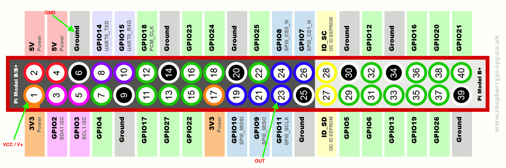

# GPIO demo package

info-beamer OS (from version 10) has support for GPIO access. The
[package sdk](https://github.com/info-beamer/package-sdk)
makes it easy to read GPIO values from your Python
[package service](https://info-beamer.com/doc/package-services).
This package demonstrates this in a minimal way: Triggering motion and displaying the amount of times the sensor saw motion on the screen.
Here's the wiring you'll need and how it works:

The PIR Sensor connects the 5V output PIN to GPIO11 of your Pi.

